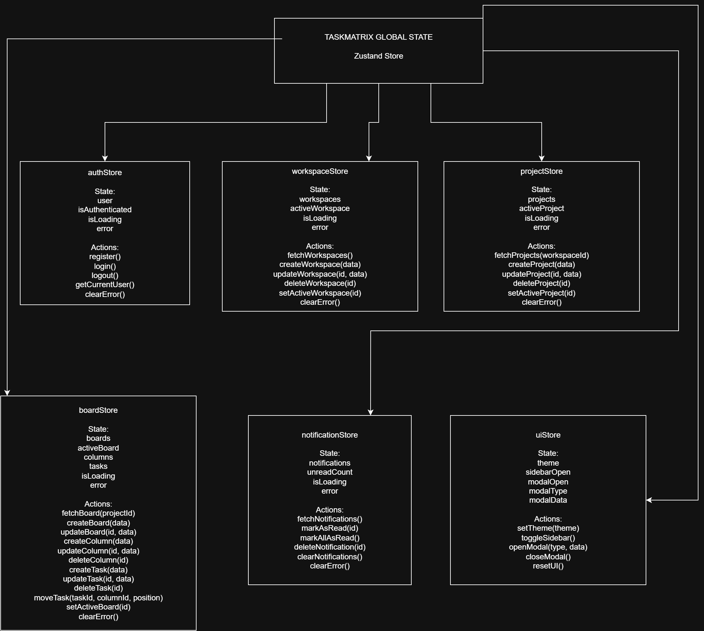

# TaskMatrix

> Enterprise Agile Project Management Capstone Application

TaskMatrix is a full-stack project management platform that helps teams create workspaces, manage projects, organize tasks on Kanban boards, assign responsibilities, track deadlines, and collaborate from one centralized dashboard.

---

## Project Information

| Field | Details |
|---|---|
| **Project Name** | TaskMatrix |
| **Repository Name** | `prodesk-capstone-taskmatrix` |
| **Designated Track** | Full-Stack MERN Development |
| **Application Type** | Enterprise Agile Project Management Platform |
| **Capstone Duration** | 4 Weeks |
| **Current Phase** | Product Planning, System Architecture, and UI/UX Design |
| **Project Status** | Planning |

---

## Table of Contents

- [Project Overview](#project-overview)
- [Problem Statement](#problem-statement)
- [Product Goals](#product-goals)
- [Target Users](#target-users)
- [User Roles](#user-roles)
- [Core Features](#core-features)
- [Technology Stack](#technology-stack)
- [UI/UX Wireframes](#uiux-wireframes)
- [System Architecture](#system-architecture)
- [Database Design](#database-design)
- [Frontend State Tree](#frontend-state-tree)
- [Mock API Endpoints](#mock-api-endpoints)
- [Security Requirements](#security-requirements)
- [Testing Strategy](#testing-strategy)
- [Deployment Plan](#deployment-plan)
- [Proposed Repository Structure](#proposed-repository-structure)
- [Four-Week Roadmap](#four-week-roadmap)
- [MVP Acceptance Criteria](#mvp-acceptance-criteria)
- [Author](#author)

---

## Project Overview

TaskMatrix will allow teams to:

- Create and manage workspaces.
- Create multiple projects inside each workspace.
- Add members and assign roles.
- Create Kanban boards and workflow columns.
- Create, update, move, assign, and delete tasks.
- Add task priorities, labels, deadlines, comments, and attachments.
- Track project progress through dashboards and activity feeds.
- Receive notifications about important project events.
- Collaborate through real-time project updates.

The application will be developed using the MERN stack and deployed as a production-ready full-stack system.

---

## Problem Statement

Many teams manage work through disconnected tools such as spreadsheets, chats, notes, and email. This creates several problems:

- Tasks are difficult to track.
- Responsibilities are unclear.
- Deadlines are missed.
- Project activity is scattered across different platforms.
- Team members cannot easily view current progress.
- Managers lack a centralized project overview.

TaskMatrix will solve these problems by providing one platform for project planning, task execution, team collaboration, and progress tracking.

---

## Product Goals

### Primary Goals

1. Provide a centralized project and task management system.
2. Support collaboration through shared workspaces.
3. Organize tasks visually using Kanban boards.
4. Protect workspace data through role-based permissions.
5. Display project progress through dashboards and analytics.
6. Provide a responsive and accessible user interface.
7. Deploy a secure and production-ready application.

### Initial Non-Goals

The first version will not include:

- Payroll management
- Employee attendance
- Video conferencing
- Advanced billing
- Native mobile applications
- Complex time-sheet management
- AI-generated project plans

---

## Target Users

TaskMatrix is designed for:

- Software development teams
- Project managers
- Product managers
- Designers
- Marketing teams
- Internship teams
- Student teams
- Freelancers
- Small businesses

---

## User Roles

### Workspace Owner

The workspace owner can:

- Update workspace information.
- Add or remove members.
- Assign member roles.
- Create and delete projects.
- View workspace analytics and activity.
- Delete the workspace.

### Workspace Admin

An admin can:

- Manage workspace members.
- Create and update projects.
- Manage boards, columns, and tasks.
- View workspace and project analytics.

### Project Member

A project member can:

- View assigned projects.
- Create and update tasks where permitted.
- Move tasks between columns.
- Add comments and attachments.
- View project activity.

### Viewer

A viewer can:

- View projects and tasks.
- View comments and progress.
- View project activity.
- Not modify protected data.

---

## Core Features

### P0 — Mandatory MVP Features

These features are required for the minimum functional product.

#### Authentication and User Management

- User registration
- User login
- User logout
- Secure password hashing
- Authenticated user profile
- Update user profile
- Protected frontend routes
- Protected backend routes

#### Workspace Management

- Create workspace
- View user workspaces
- View workspace details
- Update workspace
- Delete workspace
- Add workspace members
- Remove workspace members
- Assign member roles

#### Project Management

- Create project
- View workspace projects
- View project details
- Update project
- Delete project
- Set project status
- Set project start date
- Set project due date

#### Board and Column Management

- Create project board
- View project board
- Create workflow columns
- Rename columns
- Reorder columns
- Delete columns

#### Task Management

- Create task
- View task details
- Update task
- Delete task
- Assign task to a member
- Set task priority
- Set task deadline
- Add task labels
- Move tasks between columns
- Reorder tasks inside a column

#### Authorization and Reliability

- Role-based access control
- Request validation
- Centralized error handling
- Loading states
- Empty states
- Responsive user interface
- Production deployment

---

### P1 — Priority Features

- Drag-and-drop Kanban interaction
- Task comments
- Project activity timeline
- Project search
- Task search
- Priority filters
- Assignee filters
- Status filters
- Project dashboard analytics
- Workspace member management
- User profile image
- Due-date reminders
- Notification center
- Light and dark themes
- Pagination
- Sorting
- Mobile-responsive navigation

---

### P2 — Stretch Goals and Optimization

- Real-time board synchronization using Socket.IO
- Real-time notifications
- File attachments
- Email workspace invitations
- Password reset flow
- Project audit logs
- Export project reports
- Archive projects
- Automated frontend tests
- Automated backend tests
- API rate limiting
- Database indexing
- Optimistic UI updates
- Advanced dashboard charts
- Progressive Web App support
- Docker configuration
- Continuous integration workflow

---

## Technology Stack

### Frontend

- React
- Vite
- React Router
- Zustand
- Axios
- Tailwind CSS
- React Hook Form
- Zod
- DnD Kit
- Socket.IO Client

### Backend

- Node.js
- Express.js
- MongoDB
- Mongoose
- JSON Web Tokens
- bcrypt
- Cookie Parser
- CORS
- Helmet
- Morgan
- Express Rate Limit
- Socket.IO
- Multer
- Cloudinary

### Testing

- Vitest
- React Testing Library
- Supertest
- Postman

### Planning and Design

- Figma
- Draw.io
- MongoDB ERD
- Zustand State Tree

### Development and Deployment

- Git
- GitHub
- ESLint
- Prettier
- Vercel
- MongoDB Atlas
- Cloudinary
- Node-compatible backend hosting

---

## UI/UX Wireframes

The UI/UX design will be created in Figma before development begins.

### Required Core Viewports

1. Authentication Screen
2. Main Dashboard
3. Project Kanban Board

### Additional Planned Viewports

4. Task Details View
5. Workspace Members Screen
6. Project Analytics Screen

### Public Figma Link

Replace the placeholder below after publishing the Figma file:

**Figma File:** [View TaskMatrix UI/UX Wireframes](https://www.figma.com/design/fAYzV9dXMrd7FBxHI49H0S/TaskMatrix-%E2%80%93-UI-UX-Wireframes?node-id=0-1&t=LuWmwfozPDE2Gaix-1)
### Design Principles

- Clear visual hierarchy
- Consistent spacing
- Accessible color contrast
- Responsive layouts
- Reusable components
- Clear loading and error states
- Simple navigation
- Minimal steps for common actions

---

## System Architecture

TaskMatrix will use a client-server architecture.

```text
React Frontend
      |
      | HTTPS / REST API / WebSocket
      |
Express API Server
      |
      | Mongoose
      |
MongoDB Atlas
```

### Additional Services

- Cloudinary for file uploads
- Socket.IO for real-time communication
- Email service for invitations and password resets
- Vercel for frontend deployment

### Request Flow

1. The React frontend sends an HTTP request through Axios.
2. Express receives the request.
3. Middleware validates authentication, authorization, and request data.
4. The controller performs the required operation.
5. Mongoose communicates with MongoDB.
6. The API returns a structured JSON response.
7. Zustand updates the frontend state.
8. React updates the user interface.

---

## Architecture Diagrams

The exported diagrams will be saved inside the `docs` directory.

### MongoDB Entity Relationship Diagram


### Frontend State Tree Diagram



> The images above will appear after `taskmatrix-erd.png` and `taskmatrix-state-tree.png` are uploaded to the `docs` folder.

---

## Database Design

### Planned Collections

- `users`
- `workspaces`
- `memberships`
- `projects`
- `boards`
- `columns`
- `tasks`
- `comments`
- `activities`
- `notifications`

### Collection Relationships

```text
User ──< Membership >── Workspace
Workspace ──< Project
Project ──< Board
Board ──< Column
Project ──< Task
Column ──< Task
Task ──< Comment
User ──< Comment
Project ──< Activity
User ──< Notification
```

### User Collection

```js
{
  name: String,
  email: String,
  passwordHash: String,
  avatar: String,
  jobTitle: String,
  createdAt: Date,
  updatedAt: Date
}
```

### Workspace Collection

```js
{
  name: String,
  description: String,
  owner: ObjectId,
  logo: String,
  createdAt: Date,
  updatedAt: Date
}
```

### Membership Collection

```js
{
  workspace: ObjectId,
  user: ObjectId,
  role: "owner" | "admin" | "member" | "viewer",
  joinedAt: Date
}
```

### Project Collection

```js
{
  workspace: ObjectId,
  name: String,
  description: String,
  status: "planning" | "active" | "completed" | "archived",
  createdBy: ObjectId,
  members: [ObjectId],
  startDate: Date,
  dueDate: Date,
  createdAt: Date,
  updatedAt: Date
}
```

### Board Collection

```js
{
  project: ObjectId,
  name: String,
  createdAt: Date,
  updatedAt: Date
}
```

### Column Collection

```js
{
  board: ObjectId,
  name: String,
  position: Number,
  createdAt: Date,
  updatedAt: Date
}
```

### Task Collection

```js
{
  project: ObjectId,
  board: ObjectId,
  column: ObjectId,
  title: String,
  description: String,
  priority: "low" | "medium" | "high" | "urgent",
  assignees: [ObjectId],
  labels: [String],
  dueDate: Date,
  position: Number,
  createdBy: ObjectId,
  createdAt: Date,
  updatedAt: Date
}
```

### Comment Collection

```js
{
  task: ObjectId,
  author: ObjectId,
  content: String,
  createdAt: Date,
  updatedAt: Date
}
```

### Activity Collection

```js
{
  workspace: ObjectId,
  project: ObjectId,
  task: ObjectId,
  actor: ObjectId,
  action: String,
  metadata: Object,
  createdAt: Date
}
```

### Notification Collection

```js
{
  recipient: ObjectId,
  type: String,
  title: String,
  message: String,
  link: String,
  isRead: Boolean,
  createdAt: Date
}
```

---

## Frontend State Tree

The global state will be divided into focused Zustand stores.

```text
Global State
│
├── authStore
│   ├── user
│   ├── isAuthenticated
│   ├── isLoading
│   ├── login()
│   ├── register()
│   ├── logout()
│   └── getCurrentUser()
│
├── workspaceStore
│   ├── workspaces
│   ├── activeWorkspace
│   ├── workspaceMembers
│   ├── fetchWorkspaces()
│   ├── createWorkspace()
│   └── updateWorkspace()
│
├── projectStore
│   ├── projects
│   ├── activeProject
│   ├── projectFilters
│   ├── fetchProjects()
│   ├── createProject()
│   └── updateProject()
│
├── boardStore
│   ├── board
│   ├── columns
│   ├── tasks
│   ├── selectedTask
│   ├── fetchBoard()
│   ├── createTask()
│   ├── updateTask()
│   └── moveTask()
│
├── notificationStore
│   ├── notifications
│   ├── unreadCount
│   ├── fetchNotifications()
│   └── markAsRead()
│
└── uiStore
    ├── sidebarOpen
    ├── activeModal
    ├── theme
    ├── globalSearch
    └── toggleSidebar()
```

Local component state will be used for temporary data such as:

- Form values
- Dropdown state
- Modal state
- Hover state
- Temporary validation messages

---

## Mock API Endpoints

All planned API routes will use the `/api` prefix.

### Authentication

| Method | Endpoint | Purpose |
|---|---|---|
| POST | `/api/auth/register` | Register a user |
| POST | `/api/auth/login` | Log in a user |
| POST | `/api/auth/logout` | Log out the current user |
| GET | `/api/auth/me` | Get authenticated user |
| PATCH | `/api/auth/profile` | Update user profile |
| POST | `/api/auth/forgot-password` | Request password reset |
| POST | `/api/auth/reset-password` | Reset password |

### Workspaces

| Method | Endpoint | Purpose |
|---|---|---|
| GET | `/api/workspaces` | Get user workspaces |
| POST | `/api/workspaces` | Create workspace |
| GET | `/api/workspaces/:workspaceId` | Get workspace details |
| PATCH | `/api/workspaces/:workspaceId` | Update workspace |
| DELETE | `/api/workspaces/:workspaceId` | Delete workspace |

### Workspace Members

| Method | Endpoint | Purpose |
|---|---|---|
| GET | `/api/workspaces/:workspaceId/members` | Get workspace members |
| POST | `/api/workspaces/:workspaceId/members` | Add or invite member |
| PATCH | `/api/workspaces/:workspaceId/members/:memberId` | Update member role |
| DELETE | `/api/workspaces/:workspaceId/members/:memberId` | Remove member |

### Projects

| Method | Endpoint | Purpose |
|---|---|---|
| GET | `/api/workspaces/:workspaceId/projects` | Get workspace projects |
| POST | `/api/workspaces/:workspaceId/projects` | Create project |
| GET | `/api/projects/:projectId` | Get project details |
| PATCH | `/api/projects/:projectId` | Update project |
| DELETE | `/api/projects/:projectId` | Delete project |

### Boards and Columns

| Method | Endpoint | Purpose |
|---|---|---|
| GET | `/api/projects/:projectId/board` | Get project board |
| POST | `/api/projects/:projectId/columns` | Create column |
| PATCH | `/api/columns/:columnId` | Update column |
| PATCH | `/api/columns/reorder` | Reorder columns |
| DELETE | `/api/columns/:columnId` | Delete column |

### Tasks

| Method | Endpoint | Purpose |
|---|---|---|
| GET | `/api/projects/:projectId/tasks` | Get project tasks |
| POST | `/api/projects/:projectId/tasks` | Create task |
| GET | `/api/tasks/:taskId` | Get task details |
| PATCH | `/api/tasks/:taskId` | Update task |
| DELETE | `/api/tasks/:taskId` | Delete task |
| PATCH | `/api/tasks/:taskId/move` | Move or reorder task |
| POST | `/api/tasks/:taskId/attachments` | Add attachment |
| DELETE | `/api/tasks/:taskId/attachments/:attachmentId` | Delete attachment |

### Comments

| Method | Endpoint | Purpose |
|---|---|---|
| GET | `/api/tasks/:taskId/comments` | Get comments |
| POST | `/api/tasks/:taskId/comments` | Create comment |
| PATCH | `/api/comments/:commentId` | Update comment |
| DELETE | `/api/comments/:commentId` | Delete comment |

### Activity and Notifications

| Method | Endpoint | Purpose |
|---|---|---|
| GET | `/api/projects/:projectId/activities` | Get project activity |
| GET | `/api/notifications` | Get notifications |
| PATCH | `/api/notifications/:notificationId/read` | Mark notification as read |
| PATCH | `/api/notifications/read-all` | Mark all notifications as read |

### Analytics

| Method | Endpoint | Purpose |
|---|---|---|
| GET | `/api/workspaces/:workspaceId/analytics` | Get workspace analytics |
| GET | `/api/projects/:projectId/analytics` | Get project analytics |

---

## Standard API Response Format

### Successful Response

```json
{
  "success": true,
  "message": "Operation completed successfully.",
  "data": {}
}
```

### Error Response

```json
{
  "success": false,
  "message": "A clear error message.",
  "errors": []
}
```

---

## Security Requirements

- Hash passwords using bcrypt.
- Never return password hashes in API responses.
- Store authentication tokens securely.
- Protect private routes.
- Apply role-based authorization.
- Validate request bodies.
- Sanitize user-generated content.
- Configure CORS correctly.
- Use Helmet for secure HTTP headers.
- Add rate limiting to sensitive endpoints.
- Restrict uploaded file types and sizes.
- Store secrets in environment variables.
- Never commit `.env` files.
- Validate MongoDB ObjectIds.
- Use safe authentication error messages.

---

## Testing Strategy

### Frontend Testing

- Component rendering tests
- Form validation tests
- Authentication-flow tests
- Zustand store tests
- Board interaction tests
- Loading-state tests
- Empty-state tests
- Error-state tests

### Backend Testing

- Authentication endpoint tests
- Workspace CRUD tests
- Project CRUD tests
- Task CRUD tests
- Authorization tests
- Validation tests
- Error middleware tests

### Manual Testing

- Responsive design checks
- Browser compatibility
- Drag-and-drop behavior
- Authentication persistence
- Unauthorized access attempts
- File upload validation
- Production API connectivity

---

## Deployment Plan

### Frontend

The React frontend will be deployed using Vercel.

### Backend

The Express backend will be deployed using a Node-compatible cloud platform.

### Database

MongoDB Atlas will host the production database.

### File Storage

Cloudinary will store uploaded images and attachments.

### Planned Environment Variables

```env
NODE_ENV=
PORT=
CLIENT_URL=
MONGODB_URI=
JWT_SECRET=
JWT_EXPIRES_IN=
COOKIE_EXPIRES_IN=
CLOUDINARY_CLOUD_NAME=
CLOUDINARY_API_KEY=
CLOUDINARY_API_SECRET=
EMAIL_HOST=
EMAIL_PORT=
EMAIL_USER=
EMAIL_PASSWORD=
```

Actual environment variable values must never be committed to GitHub.

---

## Proposed Repository Structure

```text
prodesk-capstone-taskmatrix/
│
├── client/
│   ├── public/
│   └── src/
│       ├── api/
│       ├── assets/
│       ├── components/
│       ├── features/
│       ├── hooks/
│       ├── layouts/
│       ├── pages/
│       ├── routes/
│       ├── stores/
│       ├── utils/
│       ├── App.jsx
│       └── main.jsx
│
├── server/
│   └── src/
│       ├── config/
│       ├── controllers/
│       ├── middleware/
│       ├── models/
│       ├── routes/
│       ├── services/
│       ├── sockets/
│       ├── utils/
│       ├── app.js
│       └── server.js
│
├── docs/
│   ├── taskmatrix-erd.png
│   ├── taskmatrix-state-tree.png
│   └── wireframes/
│
├── .env.example
├── .gitignore
├── README.md
└── LICENSE
```

---

## Four-Week Roadmap

### Week 1 — Planning and Foundation

- Finalize product requirements.
- Create Figma wireframes.
- Create MongoDB ERD.
- Create frontend state-tree diagram.
- Define API endpoints.
- Initialize frontend and backend.
- Configure linting and formatting.
- Configure database connection.

### Week 2 — Authentication and Core Data

- Build registration and login.
- Build protected routes.
- Build user profile.
- Build workspace CRUD.
- Build membership and roles.
- Build project CRUD.

### Week 3 — Board and Task Management

- Build boards and columns.
- Build task CRUD.
- Add task assignment.
- Add priorities, labels, and deadlines.
- Add drag-and-drop.
- Add comments.
- Add filters and search.

### Week 4 — Enterprise Features and Deployment

- Add notifications.
- Add activity logs.
- Add analytics.
- Add real-time updates if time permits.
- Add tests.
- Fix responsive issues.
- Optimize API and database queries.
- Deploy frontend and backend.
- Complete final documentation.

---

## MVP Acceptance Criteria

The MVP will be considered complete when:

- A user can register, log in, and log out.
- An authenticated user can create a workspace.
- A workspace owner can add members and assign roles.
- Authorized users can create projects.
- Every project can display a Kanban board.
- Users can create, edit, move, and delete tasks.
- Tasks can be assigned to members.
- Tasks can contain priority and deadline information.
- Unauthorized users cannot access protected resources.
- The application displays loading, error, and empty states.
- The application works on desktop and mobile screens.
- The frontend and backend are deployed.
- The deployed frontend communicates with the deployed API.
- The production database stores application data.
- The README contains planning and architecture documentation.

---

## Current Project Status

**Planning Phase**

The current sprint is dedicated to:

- Product planning
- Feature prioritization
- System architecture
- Database design
- Frontend state planning
- API planning
- UI/UX wireframes

Application development will begin after the planning deliverables are completed.

---

## Author

**Mohit Korodiya**

Capstone Project for Prodesk IT Internship

---

## License

No license has been selected at this stage.
